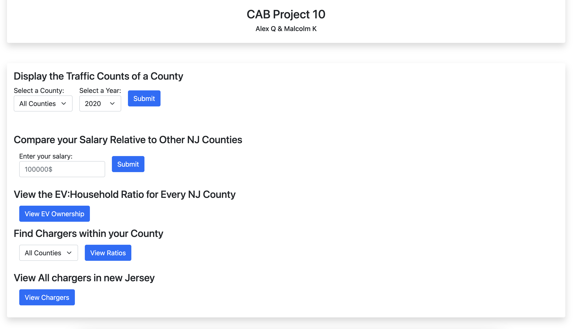

# CAB Project 10

Alex Quezada and Malcolm Kahora

## One-Time Installation

You must perform this one-time installation in the CSC 315 VM:

```
# install python pip and psycopg2 packages
sudo pacman -Syu
sudo pacman -S python-pip python-psycopg2

# install flask
pip install flask
```

## Usage

To populate the database, run the following script with sudo privileges:

```
sudo ./startup.sh
```

To run the Flask application, simply execute:

```
export FLASK_APP=app.py
flask run
# then browse to http://127.0.0.1:5000/
```

## Screenshots
  
  


